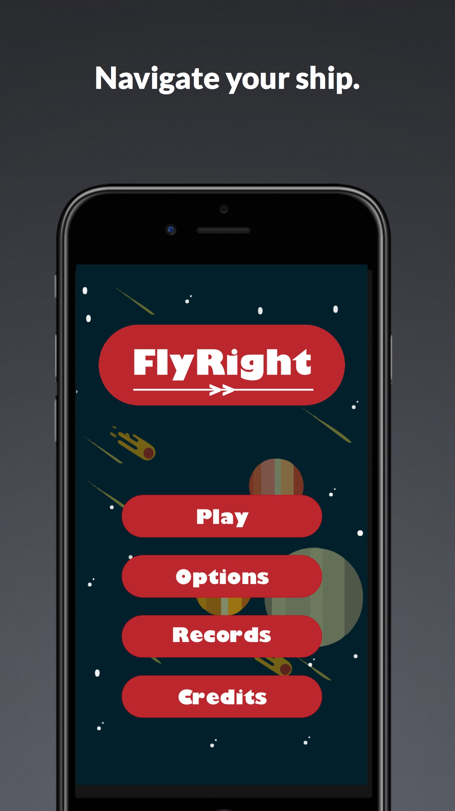
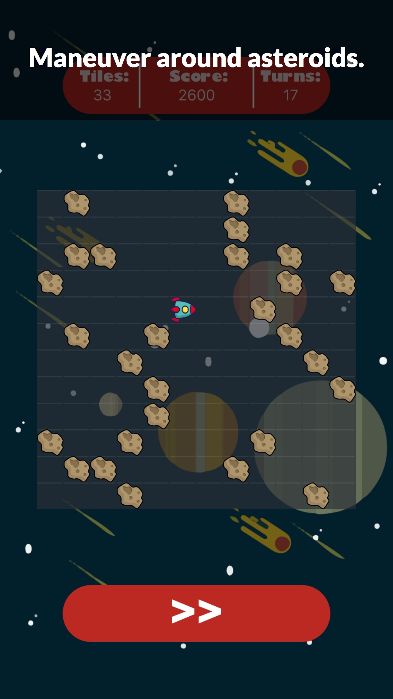
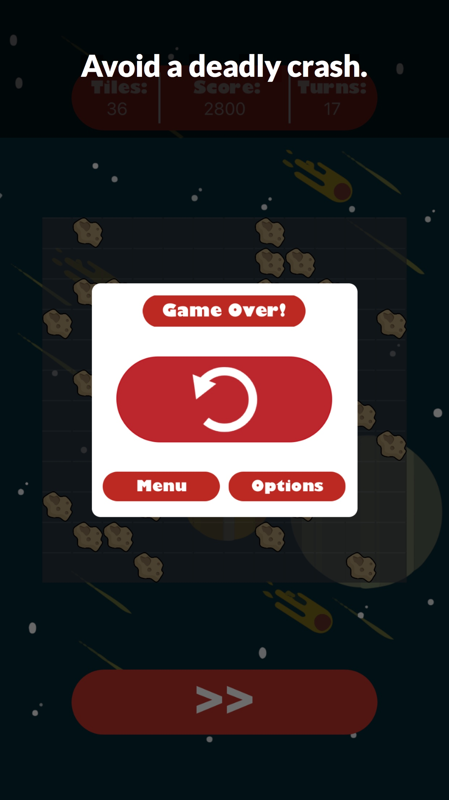
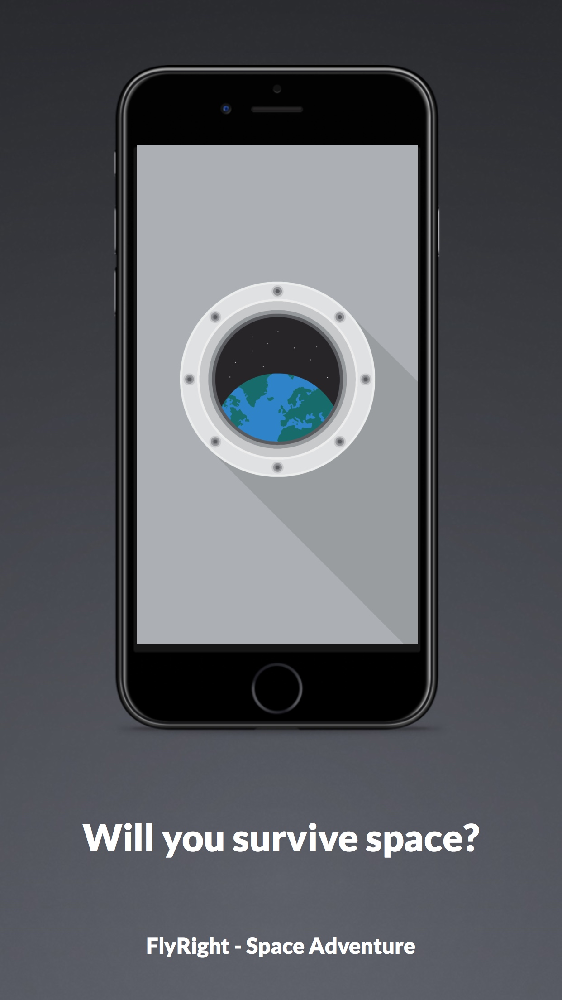

# FlyRight - Space Adventure 

*Delve into the depths of space and fight to stay alive.* 

## Table of Contents
- [Description](#description)
- [Technologies](#technologies)
- [Acknowledgements](#acknowledgements)
- [Screenshots](#screenshots)
- [Deployment](#deployment)
- [License](#license)

## Description

FlyRight is an adventure game that I created to teach myself Swift. To succeed, the player must maneuver a badly damaged spaceship inside of a grid while only being able to turn right.

## Technologies

* SpriteKit
* UIKit
* Foundation

## Acknowledgements

A thanks to outer space and back to my older brother for his support along this journey. Thank you to my two wonderful parents for being supportive and encouraging.

## Screenshots

 
 

## Deployment

This application is targeted for iOS on iPhone, iPad is unsupported. This application can be reached [here](https://appstoreprofile) or by clicking the app icon at the top of this page.

## License

 Copyright (C) 2018 Jacob Patel

 This program is free software: you can redistribute it and/or modify
 it under the terms of the GNU General Public License as published by
 the Free Software Foundation, either version 3 of the License, or
 (at your option) any later version.

 This program is distributed in the hope that it will be useful,
 but WITHOUT ANY WARRANTY; without even the implied warranty of
 MERCHANTABILITY or FITNESS FOR A PARTICULAR PURPOSE.  See the
 GNU General Public License for more details.

 You should have received a copy of the GNU General Public License
 along with this program.  If not, see <http://www.gnu.org/licenses/>.
